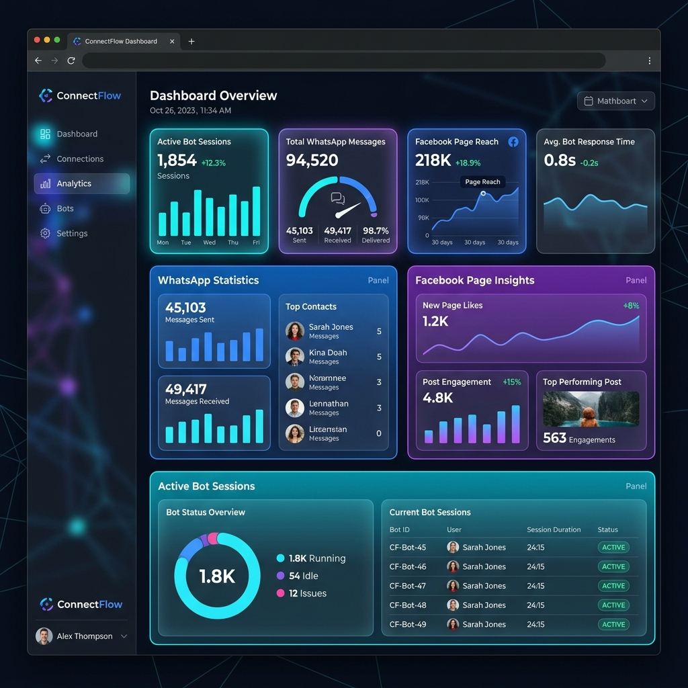
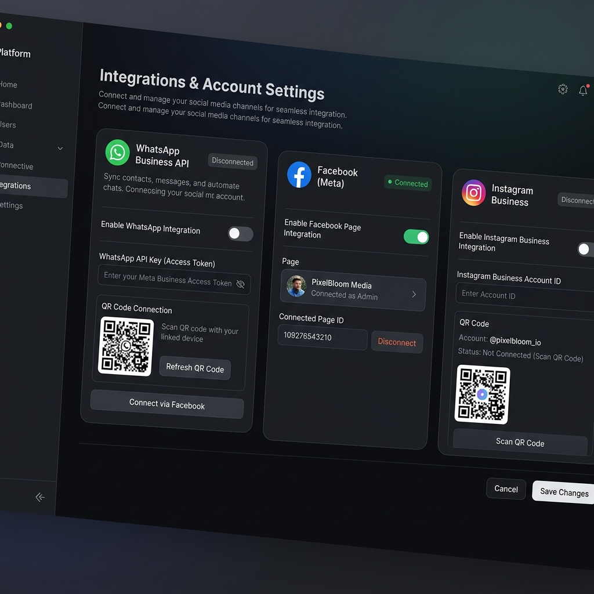

<div align="center">
  
</div>

# WhatsApp Social Bridge 🌉

WhatsApp Social Bridge is a powerful, modern enterprise application designed to connect and automate your WhatsApp Business, Facebook Pages, and Instagram Business accounts all from one sleek dashboard. 

With zero complex setup for non-technical users, this bridge acts as your central hub to view statistics, manage active bot sessions, and synchronize your cross-platform messaging.

---

## 🌟 Key Features

- **Unified Dashboard**: View analytics across WhatsApp, Facebook, and Instagram in one place.
- **WhatsApp Bot Management**: Connect your WhatsApp via a simple QR code (using Baileys WebSockets) and run automated chatbots 24/7.
- **Facebook & Instagram Integration**: Easily link your Meta Pages to track engagement and auto-publish content.
- **Modern UI/UX**: A stunning, dark-mode first design built with Next.js, Framer Motion, and Tailwind CSS.
- **Robust Backend**: Powered by NestJS, PostgreSQL (via Prisma), and Redis (for background jobs using BullMQ).

<div align="center">
  
</div>

---

## 🚀 Getting Started (For Non-Tech Users)

If you just want to use the application without looking at the code, follow these simple steps to get started!

### 1. Connect Your Database (Supabase)
1. Go to [Supabase](https://supabase.com/) and create a free account.
2. Create a new project. Once it's ready, go to **Project Settings -> Database** and copy the **Connection String (URI)**.
3. Paste that URI into the `.env` file of this project as `DATABASE_URL`.

### 2. Connect Redis (Upstash)
1. Go to [Upstash](https://upstash.com/) and create a free Redis database.
2. Copy the **Endpoint (Host)** and **Port**, and paste them into the `.env` file as `REDIS_HOST` and `REDIS_PORT`.

### 3. Deploy the App
* **Frontend:** Create an account on [Vercel.com](https://vercel.com). Import this GitHub repository, and Vercel will automatically build and host the website for you!
* **Backend:** To keep your WhatsApp bots running 24/7, deploy the backend (`apps/api`) to a platform like [Railway.app](https://railway.app) or a free Oracle Cloud Virtual Machine.

---

## 💻 Developer Setup Guide

For developers looking to run this project locally, it is built as a **Turborepo** monorepo containing a Next.js Frontend (`apps/web`) and a NestJS Backend (`apps/api`).

### Prerequisites
- [Node.js](https://nodejs.org/en/) (v20+)
- [Docker](https://www.docker.com/) (For running Postgres and Redis locally)

### 1. Start Local Databases
We have included a `docker-compose.yml` file to instantly spin up your databases.
```bash
docker compose up -d
```
*(This starts PostgreSQL on port 5432 and Redis on port 6379).*

### 2. Install Dependencies
Run this in the root of the project to install all dependencies for both the frontend and backend:
```bash
npm install
```

### 3. Setup Environment Variables
We have consolidated the environment variables into a single file at the root.
1. Copy `.env.example` to `.env`:
   ```bash
   cp .env.example .env
   ```
2. Fill out the `WHATSAPP_ACCESS_TOKEN` and `LLM_API_KEY` if you are using AI integrations.

### 4. Initialize the Database
Push the Prisma schema to your running Postgres database:
```bash
cd apps/api
npx prisma db push
```

### 5. Run the Project
To start both the Frontend and Backend simultaneously, run:
```bash
npm run dev
```

- **Frontend (Next.js)** will be available at: `http://localhost:3000`
- **Backend (NestJS)** will be available at: `http://localhost:3001`

---

## 🔗 How to Connect WhatsApp

1. Open the web portal at `http://localhost:3000`.
2. Navigate to the **Settings** or **Integrations** page.
3. Under "WhatsApp Business API", click **Scan QR Code**.
4. Open WhatsApp on your phone -> Linked Devices -> Link a Device, and scan the QR code on your screen.
5. Your session will be saved in the backend securely, and the bot will start running!

---

## 🛠 Tech Stack

- **Frontend:** Next.js 15, React 19, Tailwind CSS v4, Framer Motion, Lucide Icons.
- **Backend:** NestJS 11, Prisma ORM, BullMQ (Redis).
- **Integrations:** `@whiskeysockets/baileys` (WhatsApp), Axios.

---
*Created with ❤️ by the WhatsApp Social Bridge Team.*

